# Hi there!




## About me

I'm Ying, a self-taught *front-end developer* who's also interested in Machine Learning, AI, and Natural Language Processing. I primarily work with HTML, CSS, JavaScript, and React.js, but my favorite programming language is Python! 
In my spare time, I like doodling and playing video games.  
🕹 currently playing: Mother/Earthbound (Famicom / NES)  

### I am... 

+ 📥 Looking for work in front-end development!
+ 📖 Currently Learning: Redux, data structure, and algorithm
+ 🤖 Interested in: NLP, Machine Learning, Chatbot
+ 🦈 Fun fact about me: I like sharks
+ 📬 How to react me: [here!](#-how-to-reach-me)

(Image credit: <a href="https://storyset.com/work">Work illustrations by Storyset</a> )
<br>
<br>

## Recent Projects
🖼 **My portfolio site**: My Technical portfolio  
💻 [repo](https://github.com/yingmo55/portflio-site) | 🔗 [live: yingyimo.dev](https://yingyimo.dev)

 🍅 **Tomatodo: A minimalistic todo list app with a time display & Timer**  
💻 [repo](https://github.com/yingmo55/Todo-List) | 🔗 [live](https://tomatodo.netlify.app/)

 🖥 **An interactive quiz helps determine which language to learn**  
💻 [repo](https://github.com/yingmo55/which-language-first) | 🔗 [live](https://first-programming-language.netlify.app/)


## 🏗 Currently Working On...
🔢 **Sudoku**  　  
+ Collaboration project 
+ Technologies: React, JavaScript
+ currently: working on logic

💭**A browser based doodle app**   (on hold) 
+ prototype created. 
+ Next step: rebuild in React

🔠 **Word Search**   
+ A word search app that supports custom word list input 
+ Currently: Planning
<br />

## 📊 Stats
### Most Used Languages

[](https://github.com/yingmo55/github-readme-stats)

### WakaTime Stats

<!--START_SECTION:waka-->

```text
JavaScript   18 hrs 18 mins  ████████████████▒░░░░░░░░   65.55 %
HTML         5 hrs 31 mins   █████░░░░░░░░░░░░░░░░░░░░   19.78 %
CSS          3 hrs 2 mins    ██▓░░░░░░░░░░░░░░░░░░░░░░   10.89 %
Markdown     22 mins         ▒░░░░░░░░░░░░░░░░░░░░░░░░   01.35 %
Python       17 mins         ▒░░░░░░░░░░░░░░░░░░░░░░░░   01.06 %
JSON         12 mins         ▒░░░░░░░░░░░░░░░░░░░░░░░░   00.75 %
```

<!--END_SECTION:waka-->

## 🧰My Skills

<div style="display:flex; justify-content: center; align-item: center; flex-direction: row wrap;">
  <div style="margin: 10px;">
  <h3>👩‍💻Language</h3>
  
  
  
  
  </div>
  <div style="margin: 10px;">
  <h3>🛠 Framework</h3>
  
  
  
  
  </div>
  <div style="margin: 10px;">
  <h3>💻 Tools, Software & IDE</h3>
  
  
  
  
  </div>
</div>

<br>

## 📬 How to reach me...
<a href="https://www.linkedin.com/" target="_blank"></a> **LinkedIn:** [Yingyi Mo](https://www.linkedin.com/in/yingyimo/)  
<a href="https://hashnode.com/" target="_blank"></a>
 **Blog:** [blog.yingyimo.dev](https://blog.yingyimo.dev)  
🖼 **Portfolio:** [yingyimo.dev](https://yingyimo.dev/)  
📧 email: hello@yingyimo.dev
